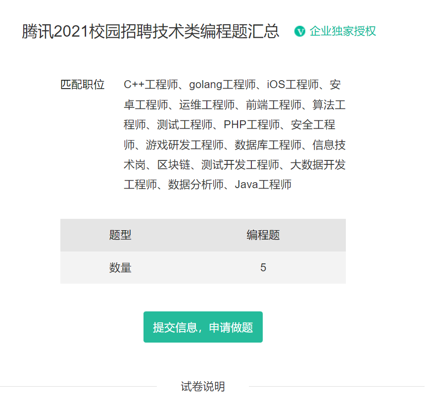
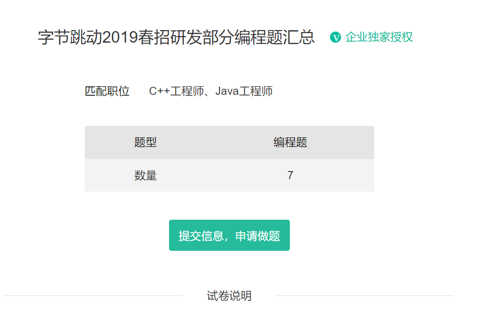
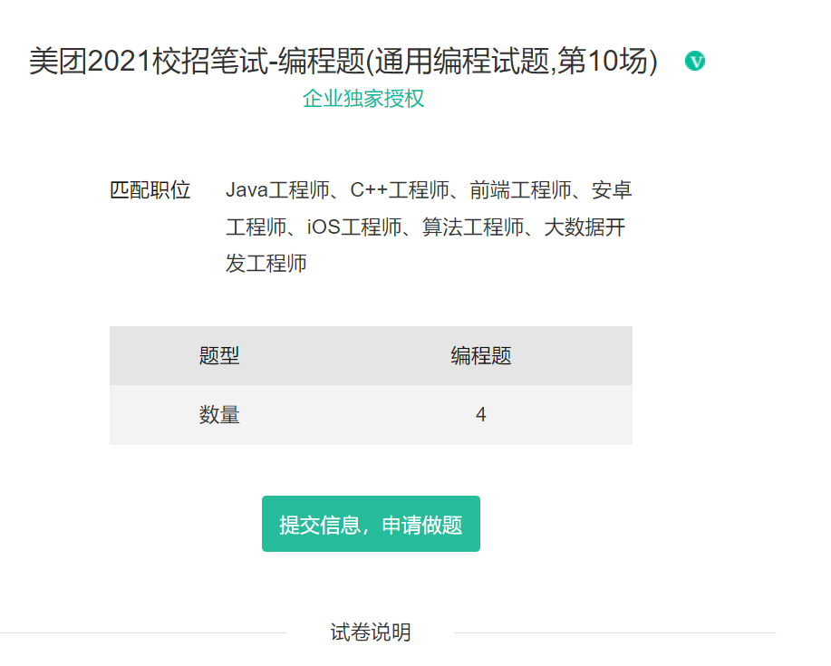

## 1.什么是数据结构
数据结构(Data Structure)是计算机存储、组织数据的方式，指相互之间存在一种或多种特定关系的
数据元素的集合。
## 2.什么是算法
算法(Algorithm):就是定义良好的计算过程，他取一个或一组的值为输入，并产生出一个或一组值作为
输出。简单来说算法就是一系列的计算步骤，用来将输入数据转化成输出结果。
## 3.数据结构和算法的重要性
### 3.1在校园招聘的笔试中：
[1.腾讯秋招技术岗编程合集](https://www.nowcoder.com/test/38431372/summary)

[2.字节跳动2019春招研发部分编程题汇总](https://www.nowcoder.com/test/16516564/summary)

[3.美团2021校招笔试-编程题(通用编程试题,第10场)](https://www.nowcoder.com/test/28665343/summary)

可以看出，现在公司对学生代码能力的要求是越来越高了，大厂笔试中几乎全是算法题而且难度
大，中小长的笔试中才会有算法题。算法不仅笔试中考察，面试中面试官基本都会让现场写代
码。而算法能力短期内无法快速提高了，至少需要持续半年以上算法训练积累，否则真正校招时
笔试会很艰难，因此算法要早早准备。

### 3.2在校园招聘的面试中:
某CVTE面试：

1.怎么计算一个类到底实例化了多少对象？

2.如果还有一个派生类继承了这个类，那么如何计算这两个类，各自实例化了多少对象？

3.你了解联合体和结构体吗？

4.如何测试一个机器是大端还是小端？

5.**你了解队列和栈吗？**

6.**怎么用两个栈实现一个队列。**

7.你使用过模版吗？

8.写一个比较两个数大小的模板函数。

9.**你使用过容器吗？**

10.**判断两个链表是否相交。**

11.**Vector和数组的区别。**

12.你在学校里做的最满意的一个项目是什么？简述一下这个项目。

某腾讯的面试：
1、自我介绍

2、**学习STL具体是怎么开展的？**

3、如果一款产品给你怎么检测内存泄露？

4、进程间通信方式，共享内存是怎么实现的，会出现什么问题，怎么解决？

5、TCP为什么是可靠的？可靠是怎么保证的？为什么要三次握手？为什么三次握手就可以可靠？

6、Http数据分包问题；

7、**Vector相关；**

8、**Hashmap相关；**

9、**红黑树的原理、时间复杂度等；**

10、Memcpy和memmove的区别；

11、客户端给服务器发送数据，意图发送aaa，然后再发bbb，但是可能会出现aaabbb这种情
况，如何处理？

12、游戏的邮件服务器中每天会有玩家频繁的创建邮件和删除邮件，海量数据、大小不一，会有
哪些场景，怎么存储，邮件是怎么到内存的？

13、写一道算法题

某百度的面试：

1.**手写五道题，三道编程题**，一道数据库，一道linux

2.数据库的题两问

3.**算法了解的如何，插入排序编程**

4.说一下IP,TCP,ARP

5.内核是什么

6.IP层主要功能

7.**map和set底层**

8.bootstrap的用法,html,html的全称

9.你觉得框架和库有啥区别

10.代码优化

11.**哈希表**

12.shell脚本

13.**快速排序思想**

14.**递归是什么**

15.分治是什么，与递归区别是什么

16.web平台是怎么做的

17.linux命令

18.了解些什么前沿的技术，英语怎么样，了解过什么英语的文献

### 3.3在未来的工作中：
[数据结构与算法对一个程序员来说的重要性？](https://www.zhihu.com/question/36579347/answer/217323640)

## 4.如何学好数据结构和算法
①死磕代码

②注意画图和思考

