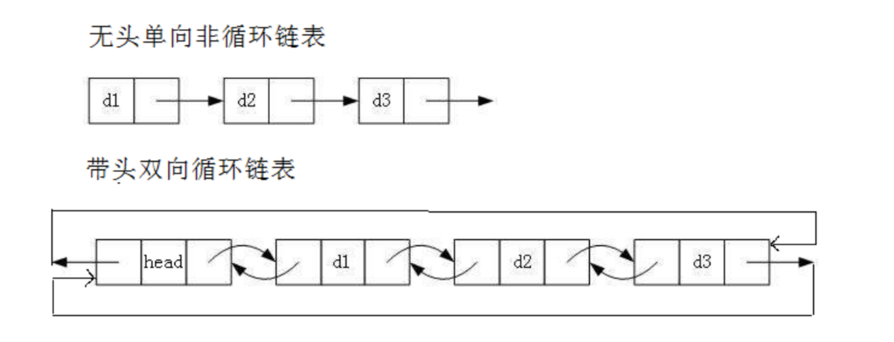

## 1. 线性表

线性表（linear list）是n个具有相同特性的数据元素的有限序列。 线性表是一种在实际中广泛使用的数据结
构，常见的线性表：顺序表、链表、栈、队列、字符串...

线性表在逻辑上是线性结构，也就说是连续的一条直线。但是在物理结构上并不一定是连续的，线性表在物
理上存储时，通常以数组和链式结构的形式存储。

## 2. 顺序表
### 2.1 概念以及结构

顺序表是用一段物理地址连续的存储单元依次存储数据元素的线性结构，一般情况下采用数组存储。在数组
上完成数据的增删查改。
顺序表一般可以分为：

1.静态顺序表：使用定长数组存储。

2.动态顺序表：使用动态开辟的数组存储。

### 2.2 接口实现

```cpp
typedef int SLTDateType;
typedef struct SListNode
{
	SLTDateType data;
	struct SListNode* next;
}SListNode;

// 动态申请一个节点
SListNode* BuySListNode(SLTDateType x);
// 单链表打印
void SListPrint(SListNode* plist);
// 单链表尾插
void SListPushBack(SListNode** pplist, SLTDateType x);
// 单链表的头插
void SListPushFront(SListNode** pplist, SLTDateType x);
// 单链表的尾删
void SListPopBack(SListNode** pplist);
// 单链表头删
void SListPopFront(SListNode** pplist);
// 单链表查找
SListNode* SListFind(SListNode* plist, SLTDateType x);
// 单链表在pos位置之后插入x
// 分析思考为什么不在pos位置之前插入？
void SListInsertAfter(SListNode* pos, SLTDateType x);
// 单链表删除pos位置之后的值
// 分析思考为什么不删除pos位置？
void SListEraseAfter(SListNode* pos);
// 单链表的销毁
void SListDestroy(SListNode** pplist);
```

### 2.3 代码实现

```cpp
#include"SListNode.h"
SListNode* BuySListNode(SLTDateType x) {
	SListNode* newnode = (SListNode*)malloc(sizeof(SListNode));
	if (newnode == nullptr) {
		printf("molloc fail\n");
		exit(-1);
	}
	newnode->data = x;
	newnode->next = nullptr;
	return newnode;
}

void SListPrint(SListNode* plist) {
	SListNode* cur = plist;
	while (cur != nullptr) {
		printf("%d->", cur->data);
		cur = cur->next;
	}
	printf("NULL\n");
}


void SListPushBack(SListNode** pplist, SLTDateType x) {
	SListNode* newnode = BuySListNode(x);
	if (*pplist == nullptr) *pplist = newnode;
	else {
		SListNode* tail = *pplist;
		while (tail->next) tail = tail->next;
		tail->next = newnode;
	}
}

void SListPushFront(SListNode** pplist, SLTDateType x) {
	SListNode* newnode = BuySListNode(x);
	newnode->next = *pplist;
	*pplist = newnode;
}

void SListPopBack(SListNode** pplist) {
	assert(*pplist);
	if ((*pplist)->next == nullptr) {
		free(*pplist);
		*pplist = nullptr;
	}
	else {
		SListNode* tail = *pplist;
		while (tail->next->next) tail = tail->next;
		free(tail->next);
		tail->next = nullptr;
	}
}

void SListPopFront(SListNode** pplist) {
	assert(*pplist);
	SListNode* next = (*pplist)->next;
	free(*pplist);
	*pplist = next;
}

SListNode* SListFind(SListNode* plist, SLTDateType x) {
	SListNode* cur = plist;
	while (cur && cur->data != x) cur = cur->next;
	if (cur && cur->data == x)return cur;
	return nullptr;
}


void SListInsertAfter(SListNode* pos, SLTDateType x) {
	assert(pos);
	SListNode* newnode = BuySListNode(x);
	newnode->next = pos->next;
	pos->next = newnode;
}


void SListEraseAfter(SListNode* pos) {
	assert(pos && pos->next);
	SListNode* nextNode = pos->next;
	pos->next = nextNode->next;
	free(nextNode);
}

void SListDestroy(SListNode** pplist) {
	SListNode* cur = *pplist;
	while (cur) {
		SListNode* next = cur->next;
		free(cur);
		cur = next;
	}
	*pplist=nullptr;
}
```

### 2.4 数组相关面试题
1. 原地移除数组中所有的元素val，要求时间复杂度为O(N)，空间复杂度为O(1)。[OJ链接](https://leetcode.cn/problems/remove-element/)

```c
int removeElement(int* nums, int numsSize, int val){
    int left = 0;
    for (int right = 0; right < numsSize; ++right)
    {
        if (nums[right] != val)
        {
            nums[left] = nums[right];
            left++;
        }
    }
    return left;
}
```

2. 删除排序数组中的重复项。[OJ链接](https://leetcode.cn/problems/remove-duplicates-from-sorted-array/)

```cpp
class Solution {
public:
    int removeDuplicates(vector<int>& nums) {
        int dst = 1, src = 1;
        while(dst < nums.size()){
           if(nums[dst] == nums[dst-1]){
               while(dst < nums.size() && nums[dst] == nums[dst-1]){
                   dst++;
               }
            }
            if(dst == nums.size()) ;
            else nums[src++]=nums[dst++];
        }
        return src;
    }
};
```

3. 合并两个有序数组。[OJ链接](https://leetcode.cn/problems/merge-sorted-array/)

```cpp
class Solution {
public:
    void merge(vector<int>& nums1, int m, vector<int>& nums2, int n) {
        int a[m + n];
        int index1 = 0,index2 = 0, k = 0;
        while(index1 < m && index2 < n){
            if(nums1[index1] < nums2[index2]){
                a[k++] = nums1[index1++];
            }
            else{
                a[k++] = nums2[index2++];
            }
        }
        while(index1 < m) a[k++] = nums1[index1++];
        while(index2 < n) a[k++] = nums2[index2++];
        for(int i = 0;i < m + n; ++i) nums1[i] = a[i]; 
    }
};
```

4. 旋转数组。[OJ链接](https://leetcode.cn/problems/rotate-array/submissions/)

```cpp
class Solution {
public:
    void rotate(vector<int>& nums, int k) {
       int n=nums.size();
        vector<int> newarr(n);
        for(int i=0;i<n;++i)
        {
            newarr[(i+k)%n]=nums[i];
        }
        nums.assign(newarr.begin(),newarr.end());
    }
};
```
5. 数组形式的整数加法。[OJ链接](https://leetcode.cn/problems/add-to-array-form-of-integer/)

```cpp
class Solution {
public:
    vector<int> addToArrayForm(vector<int>& num, int k) {
        size_t index = 0;
        vector<int> v;
        while (k) {
            v.push_back(k % 10);
            k /= 10;
            index++;
        }
        reverse(num.begin(), num.end());
        int Max = max(index, num.size()) + 1;
        while (num.size() < Max)num.push_back(0);
        while (v.size() < Max)v.push_back(0);
        vector<int> ans(Max + 1);
        for (int i = 0; i < Max; ++i) {
            ans[i] += num[i] + v[i];
            ans[i + 1] = ans[i] / 10;
            ans[i] %= 10;
        }
        while (ans[ans.size() - 1] == 0 && ans.size() != 1) ans.pop_back();
        reverse(ans.begin(), ans.end());
        return ans;
    }
};
```

### 2.5 顺序表的问题及思考

问题：

1. 中间/头部的插入删除，时间复杂度为O(N)

2. 增容需要申请新空间，拷贝数据，释放旧空间。会有不小的消耗。

3. 增容一般是呈2倍的增长，势必会有一定的空间浪费。例如当前容量为100，满了以后增容到200，
我们再继续插入了5个数据，后面没有数据插入了，那么就浪费了95个数据空间。

思考：

如何解决以上问题呢？下面给出了链表的结构来看看。

## 3. 链表
### 3.1 链表的概念及结构
概念：链表是一种物理存储结构上非连续、非顺序的存储结构，数据元素的逻辑顺序是通过链表中的指针链
接次序实现的 。

实际中链表的结构非常多样，以下情况组合起来就有8种链表结构：

1. 单向、双向

2. 带头、不带头

3. 循环、非循环


1. 无头单向非循环链表：结构简单，一般不会单独用来存数据。实际中更多是作为其他数据结构的子结
构，如哈希桶、图的邻接表等等。另外这种结构在笔试面试中出现很多。

2. 带头双向循环链表：结构最复杂，一般用在单独存储数据。实际中使用的链表数据结构，都是带头双向
循环链表。另外这个结构虽然结构复杂，但是使用代码实现以后会发现结构会带来很多优势，实现反而
简单了，后面我们代码实现了就知道了。

### 3.2 链表的实现
```cpp
typedef int SLTDateType;
typedef struct SListNode
{
	SLTDateType data;
	struct SListNode* next;
}SListNode;
 
// 动态申请一个节点
SListNode* BuySListNode(SLTDateType x);
// 单链表打印
void SListPrint(SListNode* plist);
// 单链表尾插
void SListPushBack(SListNode** pplist, SLTDateType x);
// 单链表的头插
void SListPushFront(SListNode** pplist, SLTDateType x);
// 单链表的尾删
void SListPopBack(SListNode** pplist);
// 单链表头删
void SListPopFront(SListNode** pplist);
// 单链表查找
SListNode* SListFind(SListNode* plist, SLTDateType x);
// 单链表在pos位置之后插入x
// 分析思考为什么不在pos位置之前插入？
void SListInsertAfter(SListNode* pos, SLTDateType x);
// 单链表删除pos位置之后的值
// 分析思考为什么不删除pos位置？
void SListEraseAfter(SListNode* pos);
// 单链表的销毁
void SListDestroy(SList* plist);
```

### 3.3 链表的代码实现

```cpp
#include "SList.h"

SListNode* BuySListNode(SLTDateType x)
{
	SListNode* node = (SListNode*)malloc(sizeof(SListNode));
	node->data = x;
	node->next = NULL;
 
	return node;
}
 
void SListPrint(SListNode* plist)
{
	SListNode* cur = plist;
	while (cur)
	//while (cur != NULL)
	{
		printf("%d->", cur->data);
		cur = cur->next;
	}
	printf("NULL\n");
}
 
void SListPushBack(SListNode** pplist, SLTDateType x)
{
	SListNode* newnode = BuySListNode(x);
	if (*pplist == NULL)
	{
		*pplist = newnode;
	}
	else
	{
		SListNode* tail = *pplist;
		while (tail->next != NULL)
		{
			tail = tail->next;
		}
 
		tail->next = newnode;
	}
}
 
void SListPopBack(SListNode** pplist)
{
	SListNode* prev = NULL;
	SListNode* tail = *pplist;
	// 1.空、只有一个节点
	// 2.两个及以上的节点
	if (tail == NULL || tail->next == NULL)
	{
		free(tail);
		*pplist = NULL;
	}
	else
	{
		while (tail->next)
		{
			prev = tail;
			tail = tail->next;
		}
 
		free(tail);
		tail = NULL;
 
		prev->next = NULL;
	}
}
 
 
void SListPushFront(SListNode** pplist, SLTDateType x)
{
	assert(pplist);
 
	// 1.空
	// 2.非空
	SListNode* newnode = BuySListNode(x);
	if (*pplist == NULL)
	{
		*pplist = newnode;
	}
	else
	{
		newnode->next = *pplist;
		*pplist = newnode;
	}
}
 
void SListPopFront(SListNode** pplist)
{
	// 1.空
	// 2.一个
	// 3.两个及以上
	SListNode* first = *pplist;
	if (first == NULL)
	{
		return;
	}
	else if (first->next == NULL)
	{
		free(first);
		*pplist = NULL;
	}
	else
	{
		SListNode* next = first->next;
		free(first);
		*pplist = next;
	}
}
 
SListNode* SListFind(SListNode* plist, SLTDateType x)
{
	SListNode* cur = plist;
	while (cur)
	{
		if (cur->data == x)
			return cur;
 
		cur = cur->next;
	}
 
	return NULL;
}
 
void SListInsertAfter(SListNode* pos, SLTDateType x)
{
	assert(pos);
	SListNode* next = pos->next;
	// pos newnode next
	SListNode* newnode = BuySListNode(x);
	pos->next = newnode;
	newnode->next = next;
}
 
void SListEraseAfter(SListNode* pos)
{
	assert(pos);
	// pos next nextnext
	SListNode* next = pos->next;
 
	if (next != NULL)
	{
		SListNode* nextnext = next->next;
		free(next);
		pos->next = nextnext;
	}
}
```

### 3.4 链表面试题
1.删除链表中等于给定值 val 的所有节点。[OJ链接](https://leetcode.cn/problems/remove-linked-list-elements/submissions/)
```cpp
class Solution {
public:
    ListNode* removeElements(ListNode* head, int val) {
        ListNode* newHead, * newTail;
        newHead = newTail = (ListNode*)malloc(sizeof(ListNode));
        ListNode* cur = head;
        bool flag = true, one = true;
        while (cur) {
            if (cur->val != val) {
                flag = false;
                if (!one) {
                    newTail->next = cur;
                    newTail = newTail->next;
                }
                if (one) newHead = newTail = cur, one = false;
            }
            cur = cur->next;
        }
        if (newTail) newTail->next = nullptr;
        if (flag) return nullptr;
        return newHead;
    }
};
```
2.反转一个单链表。[OJ链接](https://leetcode.cn/problems/reverse-linked-list/description/)
```cpp
class Solution {
public:
    ListNode* reverseList(ListNode* head) {
        if(!head) return nullptr;
        ListNode* n1, *n2, *n3;
        n1 = nullptr;
        n2 = head;
        n3 = head->next;  
        while(n2){
            n2->next = n1;
            n1 = n2;
            n2 = n3;
            if(n3) n3 = n3->next;
        }
        return n1;
    }
};
```
3.给定一个带有头结点 head 的非空单链表，返回链表的中间结点。如果有两个中间结点，则返回第二个
中间结点。[OJ链接](https://leetcode.cn/problems/middle-of-the-linked-list/description/)
```cpp
class Solution {
public:
    ListNode* middleNode(ListNode* head) {
        ListNode* slow, *fast;
        slow = fast = head;
        while(fast && fast->next){
            slow = slow->next;
            fast = fast->next->next;
        }
        return slow;
    }
};
```

4.输入一个链表，输出该链表中倒数第k个结点[OJ链接](https://www.nowcoder.com/practice/529d3ae5a407492994ad2a246518148a?tpId=13&&tqId=11167&rp=2&ru=/activity/oj&qru=/ta/coding-interviews/question-ranking)

```cpp
class Solution {
public:
    ListNode* FindKthToTail(ListNode* pListHead, unsigned int k) {
		if(!pListHead) return nullptr;
		ListNode* slow, *fast;
		slow = fast = pListHead;
		for (int i = 1; i <= k; ++i) {
			if (!fast) return nullptr;
			fast = fast->next;
		}
		while(fast) slow = slow->next,fast = fast->next;
		return slow;
    }
};
```


5.将两个有序链表合并为一个新的有序链表并返回。新链表是通过拼接给定的两个链表的所有节点组成
的。[OJ链接](https://leetcode.cn/problems/merge-two-sorted-lists/description/)

```cpp
class Solution {
public:
    ListNode* mergeTwoLists(ListNode* list1, ListNode* list2) {
        ListNode* guard, *tail;
        guard = tail = (ListNode*)malloc(sizeof(ListNode));
        while (list1 && list2){
            if (list1->val < list2->val){
                tail->next = list1;
                list1 = list1->next; 
                tail = tail->next;
            }else{
                tail->next = list2;
                list2 = list2->next; 
                tail = tail->next;
            }
        }
        while (list1){
            tail->next = list1;
            list1 = list1->next; 
            tail = tail->next;
        }
        while (list2){
            tail->next = list2;
            list2 = list2->next;
            tail = tail->next;
        }
        tail->next = nullptr;
        ListNode* head = guard->next;
        free(guard);
        return head;
    }
};
```

6.编写代码，以给定值x为基准将链表分割成两部分，所有小于x的结点排在大于或等于x的结点之前 。[OJ链接](https://www.nowcoder.com/practice/0e27e0b064de4eacac178676ef9c9d70?tpId=8&&tqId=11004&rp=2&ru=/activity/oj&qru=/ta/cracking-the-coding-interview/question-ranking)

```cpp
class Partition {
public:
    ListNode* partition(ListNode* pHead, int x) {
        ListNode* guard1, *tail1, *guard2, *tail2;
        guard1 = tail1 = (ListNode*)malloc(sizeof(ListNode));
        guard2 = tail2 = (ListNode*)malloc(sizeof(ListNode));
        while (pHead){
            if (pHead->val < x){
                tail1->next = pHead;
                tail1 = tail1->next;
            }else{
                tail2->next = pHead;
                tail2 = tail2->next;
            }
            pHead = pHead->next;
        }
        tail1->next = guard2->next;
        tail2->next = nullptr;
        pHead = guard1->next;
        free(guard1);
        free(guard2);
        return pHead;
    }
};
```

7.链表的回文结构。[OJ链接](https://www.nowcoder.com/practice/d281619e4b3e4a60a2cc66ea32855bfa?tpId=49&&tqId=29370&rp=1&ru=/activity/oj&qru=/ta/2016test/question-ranking)

```cpp
ListNode* middleNode(ListNode* head) {
    ListNode* slow, *fast;
    slow = fast = head;
    while (fast && fast->next) {
        slow = slow->next;
        fast = fast->next->next;
    }
    return slow;
}

ListNode* reverseList(ListNode* head) {
    if (!head) return nullptr;
    ListNode* n1, *n2, *n3;
    n1 = nullptr;
    n2 = head;
    n3 = head->next;
    while (n2) {
        n2->next = n1;
        n1 = n2;
        n2 = n3;
        if (n3) n3 = n3->next;
    }
    return n1;
}
class PalindromeList {
public:
    bool chkPalindrome(ListNode* A) {
        if (!A) return true;
        ListNode* head1 = A, *mid = middleNode(A), *head2;
        head2 = reverseList(mid);
        while (head1->next && head2->next){
            if(head1->val != head2->val) return false;
            head1 = head1->next;
            head2 = head2->next;
        }
        return true;
    }
};
```

8.输入两个链表，找出它们的第一个公共结点。[OJ链接](https://leetcode.cn/problems/intersection-of-two-linked-lists/description/)

```cpp
class Solution {
public:
    ListNode *getIntersectionNode(ListNode *headA, ListNode *headB) {
        ListNode* curA = headA, *curB = headB;
        int stepA = 0, stepB = 0;
        while (curA) stepA++, curA = curA->next;
        while (curB) stepB++, curB = curB->next;
        if (stepA < stepB) for (int i = 1; i <= abs(stepA - stepB); ++i) headB = headB->next;
        else for (int i = 1; i <= abs(stepA - stepB); ++i) headA = headA->next;
        while (headA){
            if(headA == headB) return headA;
            headA = headA->next;
            headB = headB->next;
        }
        return nullptr;
    }
};
```

9.给定一个链表，判断链表中是否有环。[OJ链接](https://leetcode.cn/problems/linked-list-cycle/description/)

```cpp
class Solution {
public:
    bool hasCycle(ListNode *head) {
        ListNode *slow, *fast;
        slow = fast = head;
        while(fast  && fast->next){
            slow = slow->next;
            fast = fast->next->next;
            if(slow == fast) return true;
        }
        return false;
    }
};
```

10.给定一个链表，返回链表开始入环的第一个节点。 如果链表无环，则返回 NULL[OJ链接](https://leetcode.cn/problems/linked-list-cycle-ii/description/)

```cpp
class Solution {
public:
    ListNode *detectCycle(ListNode *head) {
        ListNode *slow, *fast;
        slow = fast = head;
        while(fast && fast->next){
            slow = slow->next;
            fast = fast->next->next;
            if(slow == fast){
                ListNode *meet = slow; 
                while(true){
                    if(meet == head) return meet;
                    meet = meet->next;
                    head = head->next;
                }
            }
        }
        return nullptr;
    }
};
```

11.给定一个链表，每个节点包含一个额外增加的随机指针，该指针可以指向链表中的任何节点或空节点。
要求返回这个链表的深度拷贝。[OJ链接](https://leetcode.cn/problems/copy-list-with-random-pointer/description/)

```cpp
class Solution {
public:
    Node* copyRandomList(Node* head) {
        Node* cur = head;
        while (cur){
            Node* next = cur->next;
            Node* copy = (Node*)malloc(sizeof(Node));
            cur->next = copy;
            copy->val = cur->val;
            copy->next = next;
            cur = next;
        }
        cur = head;
        while (cur){
            if (cur->random) cur->next->random = cur->random->next;
            else cur->next->random = nullptr;
            cur = cur->next->next;
        }
        cur = head;
        Node* guard ,*copyTail;
        guard = copyTail = (Node*)malloc(sizeof(Node));
        while (cur){
            Node* copy = cur->next;
            Node* next = copy->next;
            copyTail->next = copy;
            copyTail = copyTail->next;
            cur->next = next;
            cur = next;
        }
        copyTail->next = nullptr;
        Node* copyHead = guard->next;
        free(guard);
        return copyHead;
    }
};
```

12.对链表进行插入排序。[OJ链接](https://leetcode.cn/problems/insertion-sort-list/)

```cpp
class Solution {
public:
    ListNode* insertionSortList(ListNode* head) {
        if (head == nullptr) return head;
        ListNode* sortHead = head;
        ListNode* cur = head->next;
        head->next = nullptr;
        while (cur){
            ListNode* next = cur->next;
            ListNode* prevA = nullptr, *curA = sortHead;
            while (curA){
                if (curA->val > cur->val) break;
                else prevA = curA, curA = curA->next;
            }
            if (!prevA) cur->next = curA, sortHead = cur;
            else prevA->next = cur, cur->next = curA;
            cur = next;
        }
        return sortHead;
    }
};
```

13.在一个排序的链表中，存在重复的结点，请删除该链表中重复的结点，重复的结点不保留，返回链表头
指针。[OJ链接](https://www.nowcoder.com/practice/fc533c45b73a41b0b44ccba763f866ef?tpId=13&&tqId=11209&rp=1&ru=/activity/oj&qru=/ta/coding-interviews/question-ranking)

```cpp
class Solution {
public:
    ListNode* deleteDuplication(ListNode* pHead) {
        if (pHead == nullptr || pHead->next == nullptr) return pHead;
        ListNode* cur = pHead, *next = cur->next;
        ListNode* guard, *tail;
        guard = tail = (ListNode*)malloc(sizeof(ListNode));
        bool flag = false;
        while(next){
            if(cur->val == next->val){
                flag = true;
                cur->next = next->next;
                free(next);
                next = cur->next;
            }
            else{
                if (flag) {
                    ListNode* del = cur;
                    cur = cur->next;
                    next = next->next;
                    free(del);
                }
                //如果next为空next->val就不能访问，且cur可以存储
                if (next == nullptr || cur->val != next->val){
                    tail->next = cur;
                    tail = tail->next;
                    cur = next;
                    if (next) next = next->next;
                    if (!next) tail->next = cur, tail = tail->next;
                //排除1,2的情况只存储了1,2没存储就退出了。
                }
                flag = false;
            }
        }
        if (tail)tail->next = nullptr;//排除tail==空的情况(1,1,2)
        pHead = guard->next;
        free(guard);
        return pHead;
    }
};
```

### 3.5 双向链表的实现

```c
#pragma once
#include<stdio.h>
#include<stdlib.h>
#include<assert.h>
typedef int LTDateType;
typedef struct ListNode
{
	struct ListNode* next;
	struct ListNode* prev;
	LTDateType date;
}ListNode;

ListNode* BuyListNode(LTDateType x);

ListNode* InitList();

void ListPushBack(ListNode* phead, LTDateType x);

void ListPrint(ListNode* phead);

void ListPushFront(ListNode* phead, LTDateType x);

void ListPopBack(ListNode* phead);

void ListPopFront(ListNode* phead);

ListNode* ListFind(ListNode* phead, LTDateType x);

//前插
void ListInert(ListNode* pos, LTDateType x);

void ListErase(ListNode* pos);

int ListEmpty(ListNode* phead);

int ListSize(ListNode* phead);

void ListDestory(ListNode* phead);
```
### 3.6 双向链表的代码实现

```c
#include"List.h"
ListNode* BuyListNode(LTDateType x)
{
	ListNode* node = (ListNode*)malloc(sizeof(ListNode));
	node->prev = NULL;
	node->next = NULL;
	node->date = x;
	return node;
}

ListNode* InitList()
{
	ListNode* phead = BuyListNode(0);
	phead->next = phead;
	phead->prev = phead;
	return phead;
}

void ListPushBack(ListNode* phead, LTDateType x)
{
	//ListNode* tail = phead->prev;
	//ListNode* newnode = BuyListNode(x);
	//tail->next = newnode;
	//newnode->prev = tail;
	//phead->prev = newnode;
	//newnode->next = phead;
	ListInert(phead, x);
}

void ListPrint(ListNode* phead)
{
	ListNode* cur = phead->next;
	while (cur != phead)
	{
		printf("%d ", cur->date);
		cur = cur->next;
	}
	printf("\n");
}


void ListPushFront(ListNode* phead, LTDateType x)
{
	//ListNode* newnode = BuyListNode(x);
	//ListNode* first = phead->next;
	//phead->next = newnode;
	//newnode->prev = phead;
	//newnode->next = first;
	//first->prev = newnode;
	ListInert(phead->next, x);
}

void ListPopBack(ListNode* phead)
{
	//assert(phead != phead->next);
	//ListNode* tail = phead->prev;
	//ListNode* tailPrev = tail->prev;
	//free(tail);
	//phead->prev = tailPrev;
	//tailPrev->next = phead;
	ListErase(phead->prev);
}

void ListPopFront(ListNode* phead)
{
	//assert(phead != phead->next);
	//ListNode* cur = phead->next;
	//ListNode* next = cur->next;
	//free(cur);
	//phead->next = next;
	//next->prev = phead;
	ListErase(phead->next);
}

ListNode* ListFind(ListNode* phead, LTDateType x)
{
	ListNode* cur = phead->next;
	while (cur!=phead)
	{
		if (cur->date == x)
		{
			return cur;
		}
		cur = cur->next;
	}
	return NULL;
}

//插入phead，相当于尾插
void ListInert(ListNode* pos, LTDateType x)
{
	ListNode* prev = pos->prev;
	ListNode* newnode = BuyListNode(x);
	prev->next = newnode;
	newnode->prev = prev;
	newnode->next = pos;
	pos->prev = newnode;
}

void ListErase(ListNode* pos)
{
	ListNode* prev = pos->prev;
	ListNode* next = pos->next;
	free(pos);
	prev->next = next;
	next->prev = prev;
}

int ListEmpty(ListNode* phead)
{
	//是空返回1，不是空返回0,无C99
	return phead->next == phead ? 1 : 0;
}

int ListSize(ListNode* phead)
{
	ListNode* cur = phead->next;
	int size = 0;
	while (cur != phead)
	{
		++size;
		cur = cur->next;
	}
	printf("%d\n",size);
}

void ListDestory(ListNode* phead)
{
	ListNode* cur = phead->next;
	while (cur != phead)
	{
		ListNode* next = cur->next;
		free(cur);
		cur = next;
	}
	free(phead);
	phead = NULL;
}
```


### 3.7 顺序表和链表的区别和联系

顺序表：

优点：空间连续、支持随机访问

缺点：1.中间或前面部分的插入删除时间复杂度O(N) 2.增容的代价比较大。

链表：

缺点：以节点为单位存储，不支持随机访问

优点：1.任意位置插入删除时间复杂度为O(1) 2.没有增容问题，插入一个开辟一个空间。
