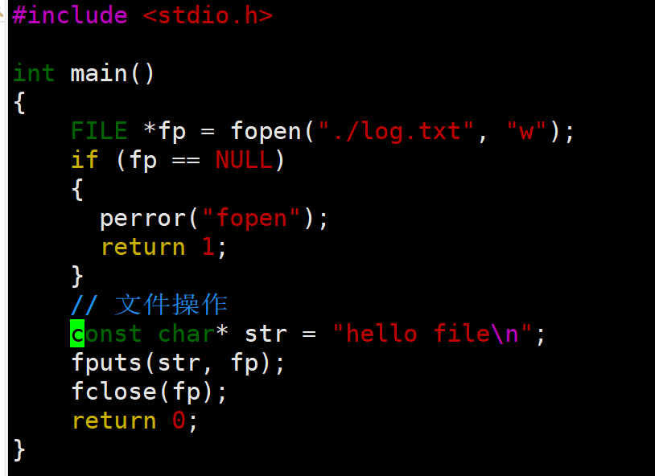
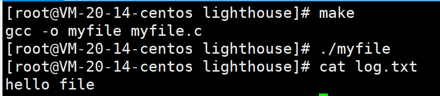
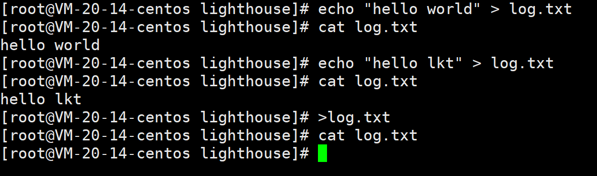
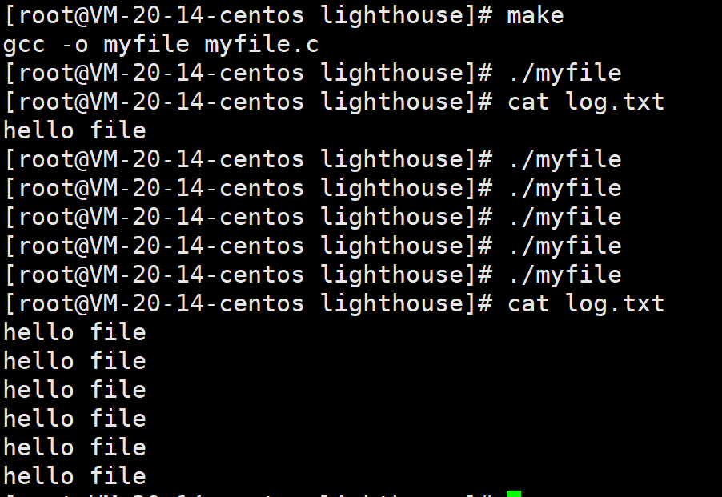
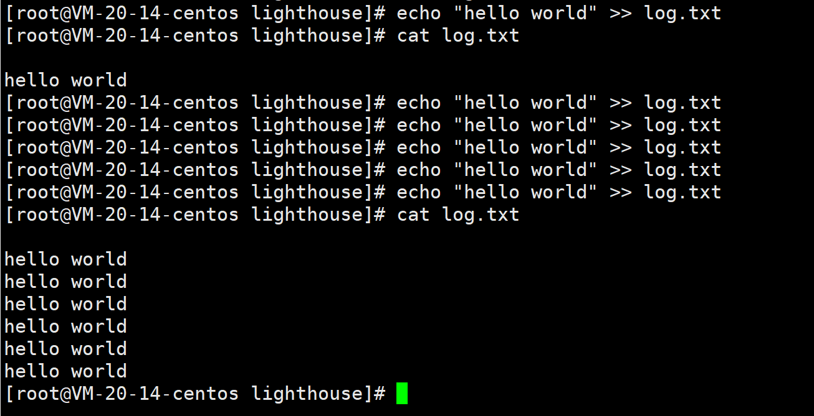
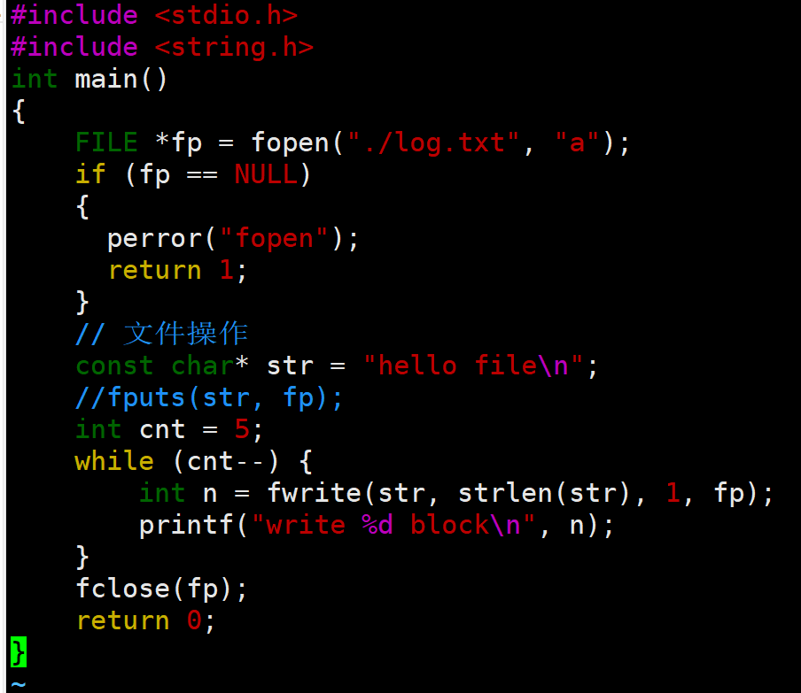

# 基础IO
## 铺垫
问：建立一个空文件需要不要在磁盘上占据空间？

答：要占据。

a. 文件 = 内容 + 属性。

b. 访问文件之前，得先打开文件。而修改文件时，文件必须被加载到内存。无法直接修改硬件上的文件。

问：谁来打开文件？

答. 进程在打开文件。

问：一个进程可以打开多少个文件？

答. 进程可以打开多个文件。

问：一定时间段内，系统中存在多个进程，也可能存在更多的被打开的文件，操作系统要不要管理多个被进程打开的文件呢？

答. 肯定要。

问：操作系统如何管理呢？

答. 先描述，在组织（内核中一定要有描述被打开文件的结构体，并用其定义对象）

到这里我们就明白学习文件就是弄清楚进程和文件的关系，struct task_struct 和 struct XXX的关系？

问：系统中是不是所有文件都被进程打开了呢？

答：不是

问：没有被打开的文件在哪？

答： 在磁盘中，叫做**磁盘文件**。上面的叫做**内存文件**。

## 重新使用C文件接口 --- 对比一下重定向
先使用基本的C语言写一段代码

运行之后出现

然后将str删掉，结果log.txt里面就是空，说明w写文件会清空原始文件,那么再让我们重新写一下重定向

我们现在把w改成a

发现有非常相似之处

## 认识文件操作的系统接口

现在我们来介绍一下fwrite

size_t fwrite ( const void * ptr, size_t size, size_t count, FILE * stream );

ptr是读取文件, size是读取文件大小, count是读取几个这样的大小, stream是写入文件, 返回值是count。

问：什么叫做当前路径？

现在我们用getpid获取他的pid，然后我们ls proc/pid -l, 我们会发现一个cwd -> 当前路径

这里有一个函数叫做chdir(路径),可以修改当前路径。但是我们查看log.txt里面的内容还是0，知道程序运行结束才可以看到里面有内容。

下面我们来介绍fopen的r模式

一行一行读取,用fgets

char * fgets ( char * str, int num, FILE * stream );

str:读取的文件内容放入的地方。

num:该地方的大小。

stream: 从哪里读入。

问：程序默认打开的文件流？

stdin(标准输入,键盘设备)

stdout(标准输出, 显示器设备)

stderr(标准错误, 显示器设备)

stdin、stdout、stderr都可以直接被使用

访问文件不仅仅有C语言的接口，操作系统必须提供对应的访问文件的系统调用。

下面介绍一下open函数

int open(const char *pathname, int flags);

int open(const char *pathname, int flags, mode_t mode);

flag是用位图的方式来确定是否调用内部函数,用 | 操作符就可以，mode是为了O_CREAT创建新文件给权限的(所给权限还受umask影响)。

以O_WDNOLY打开不会清空先前文件的内容，要加上O_TRUNC才能清空。 O_APPEND是追加。

fd默认前1、2、3被称之为：标准输入、标准输出、标准错误。open返回值前3个已经被占取，所以我们打开文件fd都是从3开始。

结论：C语言的文件接口，本质就是封装了系统调用。

问：FILE是什么？

答：FILE是C语言标准库自己封装的一个结构体，必定要封装特定的fd!!!打印stdin->fileno就可以查看no;

问：为什么C语言要封装?

答：为了保证自己的跨平台性。

## 引入文件描述符fd && 对文件的理解

问：进程怎么知道打开了那些文件？为什么后续访问文件，用系统调用接口，都必须使用fd呢？

答：task_struct 是进程管理里面存在struct file_struct *files指向struct files_struct。files_struct 里面还包含了 struct file * fd_array[]
一个指针数组。指针数组指向的就是每一个struct file.然后修改文件的缓冲区，最后加载到磁盘上。

结论：文件描述符的本质，就是数组下标。

问：如何理解一切皆文件？

答：就是函数指针，来接受写的，读的来获取，屏蔽了硬件的差异。

fd的分配规则： 最小的没有被使用的数组下标，会分配给最新打开的文件。
## 理解重定向 理解缓冲区

close(1),然后再open一个新文件，然后在printf，就会发现printf写入的是那个新文件，这是由于fd = 1的stdout被改成了新文件，
所以写入的是新文件。但是这样写会比较麻烦，所以有一个int dup2(int oldfd, int newfd);将old拷贝到new，所以dup2(fd, 1)
就可以完成缓冲区。