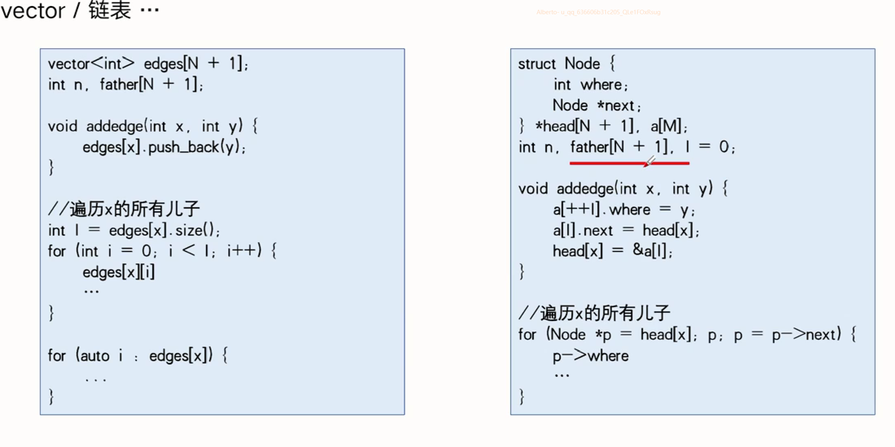

# 树

## 树的相关概念


## 树的存储方式



## 有根树的DFS序


## 有根树的BFS序


## 无根树


## 无根树的DFS和BFS


## 求树上路径


```cpp
// 1.dfs
#include <bits/stdc++.h>
using namespace std;
typedef long long ll;
ll n, pre[100001], c[100001], l;
vector<int> edges[100001];

inline void dfs(ll x) {
	for (auto y : edges[x]) {
		if (y != pre[x]) {
			pre[y] = x;
			dfs(y);
		}
	}
}

int main() {
	scanf("%lld", &n);
	for (ll i = 1; i < n; ++i) {
		ll x, y;
		scanf("%lld%lld", &x, &y);
		edges[x].push_back(y);
		edges[y].push_back(x);
	}
	ll u, v;
	scanf("%lld%lld", &u, &v);
	pre[u] = -1;
	dfs(u);
	l = 0;
	for (ll i = v; i != u; i = pre[i])
		c[++l] = i;
	c[++l] = u;
	for (ll i = l; i; --i)
		printf("%lld ", c[i]);
	printf("\n");
	return 0;
}

// 2.bfs
#include <bits/stdc++.h>
using namespace std;
typedef long long ll;
ll n, pre[100001], c[100001], l, q[100001], rear = 0, front = 1;
vector<int> edges[100001];

inline void bfs(ll u) {
	q[++rear] = u;
	while (front <= rear) {
		ll x = q[front];
		++front;
		for (auto y : edges[x]) {
			if (y != pre[x]) {
				pre[y] = x;
				q[++rear] = y;
			}
		}
	}
}

int main() {
	scanf("%lld", &n);
	for (ll i = 1; i < n; ++i) {
		ll x, y;
		scanf("%lld%lld", &x, &y);
		edges[x].push_back(y);
		edges[y].push_back(x);
	}
	ll u, v;
	scanf("%lld%lld", &u, &v);
	pre[u] = -1;
	bfs(u);
	l = 0;
	for (ll i = v; i != u; i = pre[i])
		c[++l] = i;
	c[++l] = u;
	for (ll i = l; i; --i)
		printf("%lld ", c[i]);
	printf("\n");
	return 0;
}
```

## 树的直径


```cpp
#include <bits/stdc++.h>
using namespace std;
typedef long long ll;
ll n, dist[1000001], pre[1000001];
vector<int> edges[1000001];

inline void dfs(ll x) {
	for (auto y : edges[x])
		if (y != pre[x]) {
			pre[y] = x;
			dist[y] = dist[x] + 1;
			dfs(y);
		}
}
int main() {
	scanf("%lld", &n);
	for (ll i = 1; i <= n - 1; ++i) {
		ll x, y;
		scanf("%lld%lld", &x, &y);
		edges[x].push_back(y);
		edges[y].push_back(x);
	}
	memset(dist, 0, sizeof(dist));
	memset(pre, 0, sizeof(pre));
	pre[1] = -1;
	dfs(1);
	ll idx = 0, v = 0;
	for (ll i = 1; i <= n; ++i)
		if (dist[i] > v)
			idx = i, v = dist[i];
	memset(dist, 0, sizeof(dist));
	memset(pre, 0, sizeof(pre));
	pre[idx] = -1;
	dfs(idx);
	v = 0;
	for (ll i = 1; i <= n; ++i)
		v = max(v, dist[i]);
	printf("%lld\n", v);
	return 0;
}
```