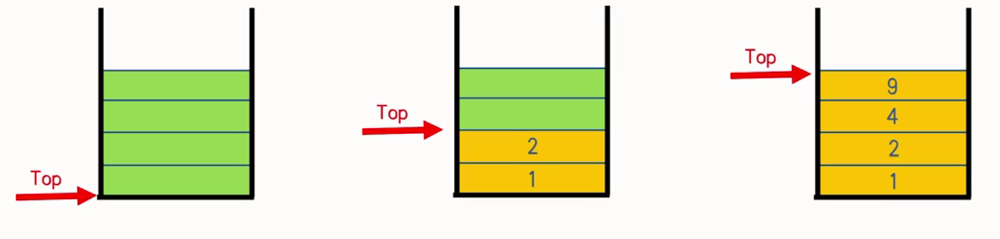

# 栈

## 栈的简介
+ 收快递箱子, 我们会把箱子从下往上一个一个堆起来
+ 箱子堆结构稳定, 一般情况下就只能动**最上面**的箱子, 比如拿走它或者堆新的箱子上去
+ 如果试图直接从中间抽走一个箱子，整堆箱子就会倒塌

+ 栈(Stack)是一种类似于箱子堆或储物桶的数据结构，我们可以往里面存入或取出数据
+ 栈按照**先进后出**的原则存储数据，每次新进入的数据都会被放在最上面，越先进入的数据在越下面，越后进入的数据在越上面
+ 我们只能对最上面的数据进行操作
+ 栈的两大元素:栈的大小和栈顶指针Top(指向栈最上面的位置)。

## 栈的基本操作 
+ 新建
+ 插入数据
+ 删除栈顶数据
+ 如何查询栈顶数据？
+ 如何清空一个栈？
+ 实现栈的几个基本操作:

push x: 将x这个元素放到栈顶

pop: 将栈顶元素删除

top: 询问栈顶元素是多少
```
样例输入:          样例输出:
10                 2
push 1             1
push 2             3
top                4
pop
top
push 3
top
pop
push 4
top
```

新建:
```cpp
int s[10];
int top = 0;
```

Push
```cpp
void Push(int x) {
    s[++top] = x;
}
```

Pop
```cpp
void Pop() {
    if (top == 0)
        Error;
    --top;
}
```

## 例题一:
栈是一种数据结构。现在你要支持几种操作：

+ push x，将x这个元素放到栈顶。
+ pop，将栈顶元素删除。
+ top，询问栈顶元素是多少。

输入格式:
第一行一个整数 m，表示操作个数。

接下来 m 行，每行一个上面所述的操作。

输出格式:
输出若干行，对于每个查询操作，输出答案。
```
样例输入          样例输出
10                2
push 1            1
push 2            3
top               4
pop
top
push 3
top
pop
push 4
top
```
数据规模

对于 100%的数据，保证 1≤m≤1e5。

对于 push 操作，保证 1≤x≤1e9。

对于 pop 和 top 操作，保证栈非空。

AC代码:
```cpp
#include <bits/stdc++.h>
using namespace std;
typedef long long ll;
ll a[100001], m, top;
char s[11];
int main() {
	scanf("%lld", &m);
	while (m--) {
		scanf("%s", s);
		if (s[1] == 'u') {
			ll x;
			scanf("%lld", &x);
			a[++top] = x;
		}
		else if (s[0] == 't')
			printf("%lld\n", a[top]);
		else 
			--top;
	}
	return 0;
}
```