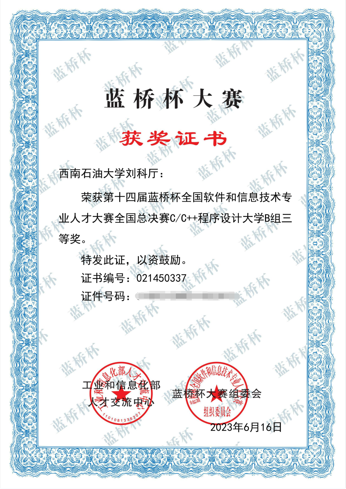

自我介绍
本人是SWPU的一名学生，2022级，希望自己以后可以成为一名合格的后端开发程序员。

我的编程计划：

1.关于C语言：C/C++在几十年都一直位于前三名，所以足以证明他的经典性和重要性。C语言本身是较为基础的语言，所以很对于新生入门非常友好，只需认真听学校老师讲课+课后练习即可。

2.关于算法和数据结构：近年来算法和数据结构成为了进入大厂的第一关笔试，想要进入大厂算法和数据结构是必不可少的，而这一块的知识又是有一定难度的，所以需要注重实践，多画图，多练习。

3.关于Linux操作系统和网络编程：这一块的知识在高校一般很少教，但是又非常的重要，在校招的题目中随处可见，所以学好这一部分要多买书来看，注重实践，还可以在MOOC上寻找视频来看。注重理论+实践。

4.学习MYSQL数据库，也是必备的技能之一。

5.开发做项目。

6.努力学习英语,达到可以阅读文献的能力，不然在工作中拓展的时候很吃力。

7.坚持敲代码,俗话说熟能生巧。

目前获得的奖项:
