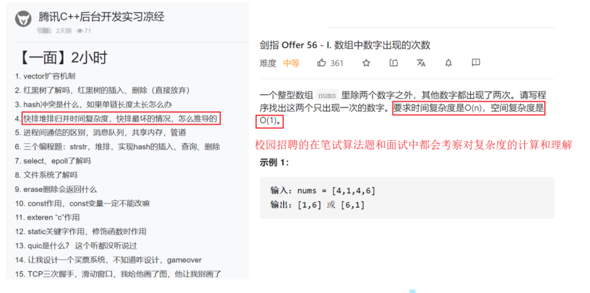
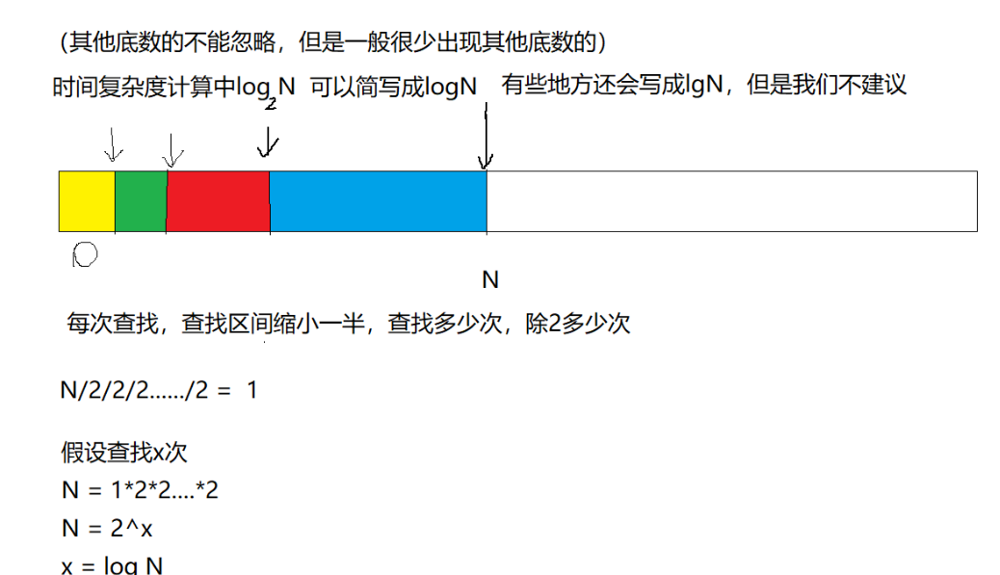
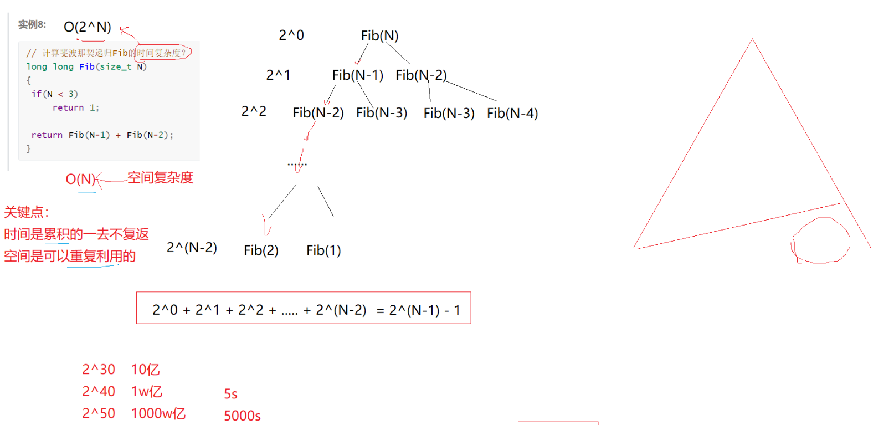
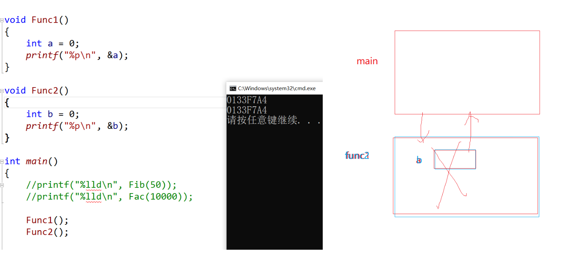
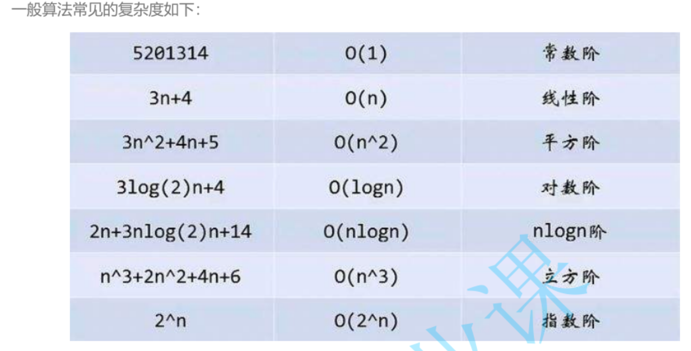
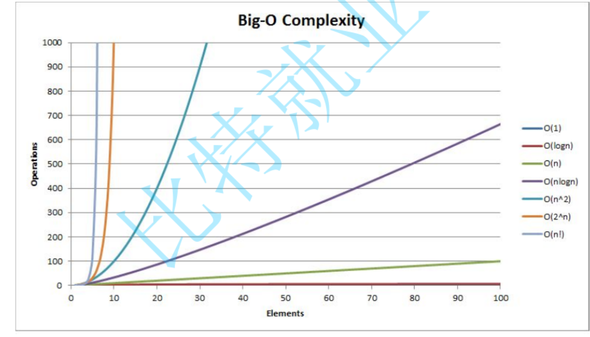

## 1.算法效率
### 1.1 如何衡量一个算法的好坏

如何衡量一个算法的好坏呢？比如对于以下斐波那契数列：

```c
long long Fib(int N)
{
	if (N < 3)
		return 1;
	return Fib(N - 1) + Fib(N - 2);
}
```

斐波那契数列的递归实现方式非常简洁，但简洁一定好吗？那该如何衡量其好与坏呢？

### 1.2 算法的复杂度

算法在编写成可执行程序后，运行时需要耗费时间资源和空间(内存)资源 。因此
**衡量一个算法的好坏,一般是从时间和空间两个维度来衡量的**，即时间复杂度和空间复杂度。

**时间复杂度主要衡量一个算法的运行快慢，而空间复杂度主要衡量一个算法运行所需要的额外空间。**在计算
机发展的早期，计算机的存储容量很小。所以对空间复杂度很是在乎。但是经过计算机行业的迅速发展，计
算机的存储容量已经达到了很高的程度。所以我们如今已经不需要再特别关注一个算法的空间复杂度。

### 1.3 复杂度在校招中的考察



## 2.时间复杂度
### 2.1时间复杂度的概念

时间复杂度的定义：在计算机科学中，算法的时间复杂度是一个函数，它定量描述了该算法的运行时间。一
个算法执行所耗费的时间，从理论上说，是不能算出来的，只有你把你的程序放在机器上跑起来，才能知
道。但是我们需要每个算法都上机测试吗？是可以都上机测试，但是这很麻烦，所以才有了时间复杂度这个
分析方式。一个算法所花费的时间与其中语句的执行次数成正比例，算法中的基本操作的执行次数，为算法
的时间复杂度。

即：找到某条基本语句与问题规模N之间的数学表达式，就是算出了该算法的时间复杂度。

```c
// 请计算一下Func1中++count语句总共执行了多少次？
void Func1(int N)
{
	int count = 0;
	for (int i = 0; i < N; ++i)
	{
		for (int j = 0; j < N; ++j)
		{
			++count;
		}
	}
	for (int k = 0; k < 2 * N; ++k)
	{
		++count;
	}
	int M = 10;
	while (M--)
	{
		++count;
	}
	printf("%d\n", count);
}
```

**Func1 执行的基本操作次数 ：**

$F(N)=N^2+2*N+10$

* N=10    F(N)=130
* N=100   F(N)=10210
* N=10000 F(N)=1002010

实际中我们计算时间复杂度时，我们其实并不一定要计算精确的执行次数，而只需要
**大概执行次数，那么这里我们使用大O的渐进表示法。**

## 2.2 大O的渐进表示法
大O符号（Big O notation）：是用于描述函数渐进行为的数学符号。

推导大O阶方法：

1、用常数1取代运行时间中的所有加法常数。

2、在修改后的运行次数函数中，只保留最高阶项。

3、如果最高阶项存在且不是1，则去除与这个项目相乘的常数。得到的结果就是大O阶。
使用大O的渐进表示法以后，Func1的时间复杂度为

$O(N^2)$

* N=10   F(N)=100
* N=100  F(N)=10000
* N=1000 F(N)=1000000
通过上面我们会发现大O的渐进表示法去掉了那些对结果影响不大的项，简洁明了的表示出了执行次数。

另外有些算法的时间复杂度存在最好、平均和最坏情况：

最坏情况：任意输入规模的最大运行次数(上界)

平均情况：任意输入规模的期望运行次数

最好情况：任意输入规模的最小运行次数(下界)

例如：在一个长度为N数组中搜索一个数据x

最好情况：1次找到

最坏情况：N次找到

平均情况：N/2次找到

**在实际中一般情况关注的是算法的最坏运行情况，所以数组中搜索数据时间复杂度为O(N)**

## 2.3常见时间复杂度计算举例

实例一:
```c
// 计算Func2的时间复杂度？(O(N))
void Func2(int N)
{
	int count = 0;
	for (int k = 0; k < 2 * N; ++k)
	{
		++count;
	}
	int M = 10;
	while (M--)
	{
		++count;
	}
	printf("%d\n", count);
}
```

实例2：
```c
// 计算Func3的时间复杂度？(O(M+N))
void Func3(int N, int M)
{
	int count = 0;
	for (int k = 0; k < M; ++k)
	{
		++count;
	}
	for (int k = 0; k < N; ++k)
	{
		++count;
	}
	printf("%d\n", count);
}
```

实例3:
```c
// 计算Func4的时间复杂度？(O(1))
void Func4(int N)
{
	int count = 0;
	for (int k = 0; k < 100; ++k)
	{
		++count;
	}
	printf("%d\n", count);
}
```

实例4:
```c
// 计算strchr的时间复杂度？(O(N))
const char * strchr ( const char * str, int character );
```

实例5：
```c
// 计算BubbleSort的时间复杂度？(O(N^2))
void BubbleSort(int* a, int n)
{
	assert(a);
	for (size_t end = n; end > 0; --end)
	{
		int exchange = 0;
		for (size_t i = 1; i < end; ++i)
		{
			if (a[i - 1] > a[i])
			{
				Swap(&a[i - 1], &a[i]);
				exchange = 1;
			}
		}
		if (exchange == 0)
			break;
	}
}
```

实例6:
```c
// 计算BinarySearch的时间复杂度？(O(logN))(注:log默认是以2为底数)
int BinarySearch(int* a, int n, int x)
{
	assert(a);
	int begin = 0;
	int end = n - 1;
	// [begin, end]：begin和end是左闭右闭区间，因此有=号
	while (begin <= end)
	{
		int mid = begin + ((end - begin) >> 1);
		if (a[mid] < x)
			begin = mid + 1;
		else if (a[mid] > x)
			end = mid - 1;
		else
			return mid;
	}
	return -1;
}
```


对比表

|N|暴力查找|二分查找|
|----|----|----|
|1000|1000(2^10)|10|
|100W|100W(2^20)|20|
|10亿|10亿(2^30)|30|

实例7：
```c
// 计算阶乘递归Fac的时间复杂度？(O(N))
long long Fac(size_t N)
{
	if (0 == N)
		return 1;
	return Fac(N - 1) * N;
}
```

实例8:
```c
// 计算斐波那契递归Fib的时间复杂度？(O(2^N))
long long Fib(size_t N)
{
	if (N < 3)
		return 1;
	return Fib(N - 1) + Fib(N - 2);
}
```
这个实例比较难，类似细胞分裂,上图：



疑问：栈的空间如此的小，为什么当N=50的时候，2^50的size_t的空间不会崩溃

解答：上图已经解释过了，时间的利用是一去不复返，空间可以重复利用，再上一个图吧!



## 3.空间复杂度

空间复杂度也是一个数学表达式，
**是对一个算法在运行过程中临时占用存储空间大小的量度 。**

空间复杂度不是程序占用了多少bytes的空间，因为这个也没太大意义，所以空间复杂度算的是变量的个数。
空间复杂度计算规则基本跟实践复杂度类似，也使用
**大O渐进表示法。**

**注意：函数运行时所需要的栈空间(存储参数、局部变量、一些寄存器信息等)在编译期间已经确定好了，因**
**此空间复杂度主要通过函数在运行时候显式申请的额外空间来确定**

实例一：
```c
// 计算BubbleSort的空间复杂度？(O(1))
void BubbleSort(int* a, int n)
{
	assert(a);
	for (size_t end = n; end > 0; --end)
	{
		int exchange = 0;
		for (size_t i = 1; i < end; ++i)
		{
			if (a[i - 1] > a[i])
			{
				Swap(&a[i - 1], &a[i]);
				exchange = 1;
			}
		}
		if (exchange == 0)
			break;
	}
}
```

实例2:
```c
// 计算Fibonacci的空间复杂度？(O(N))
// 返回斐波那契数列的前n项
long long* Fibonacci(size_t n)
{
	if (n == 0)
		return NULL;
	long long* fibArray = (long long*)malloc((n + 1) * sizeof(long long));
	fibArray[0] = 0;
	fibArray[1] = 1;
	for (int i = 2; i <= n; ++i)
	{
		fibArray[i] = fibArray[i - 1] + fibArray[i - 2];
	}
	return fibArray;
}
```

实例3:
```c
// 计算阶乘递归Fac的空间复杂度？(O(N))
long long Fac(size_t N)
{
	if (N == 0)
		return 1;
	return Fac(N - 1) * N;
}
```

## 4.常见复杂度对比





## 5. 复杂度的oj练习

[5.1消失的数字OJ](https://leetcode.cn/problems/missing-number-lcci/)

```c
//思路一：求总和-每一个数字
//时间复杂度O(N),空间复杂度O(1)
int missingNumber(int* nums, int numsSize) {
    int N = numsSize;
    int ret = N * (N + 1) / 2;
    for (int i = 0; i < numsSize; ++i)
    {
        ret -= nums[i];
    }
    return ret;
}
//思路二：qsort排序(排除)
//时间复杂度O(N*logN),空间复杂度(logN)(后面排序会说，暂且记住)

//思路三：异或->找单身狗问题
//时间复杂度O(N),空间复杂度O(1)
int missingNumber(int* nums, int numsSize) {
    int N = numsSize;
    int x = 0;
    for (int i = 0; i < numsSize; ++i)
    {
        x ^= nums[i];
    }
    for (size_t j = 0; j < N + 1; ++j)
    {
        x ^= j;
    }
    return x;
}

//
```


[5.2 旋转数组OJ](https://leetcode.cn/problems/rotate-array/)
待更新！！！！


<script type="text/javascript" async
  src="https://cdnjs.cloudflare.com/ajax/libs/mathjax/2.7.7/latest.js?config=TeX-MML-AM_CHTML">
</script>

<script type="text/x-mathjax-config">
MathJax.Hub.Config({
  tex2jax: {inlineMath: [['$','$'], ['\\(','\\)']]}
});
</script>

